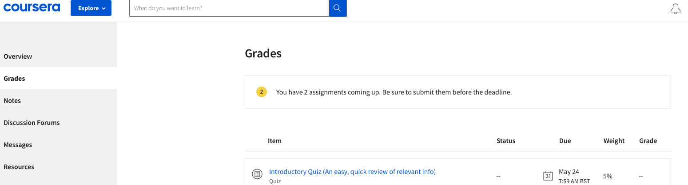
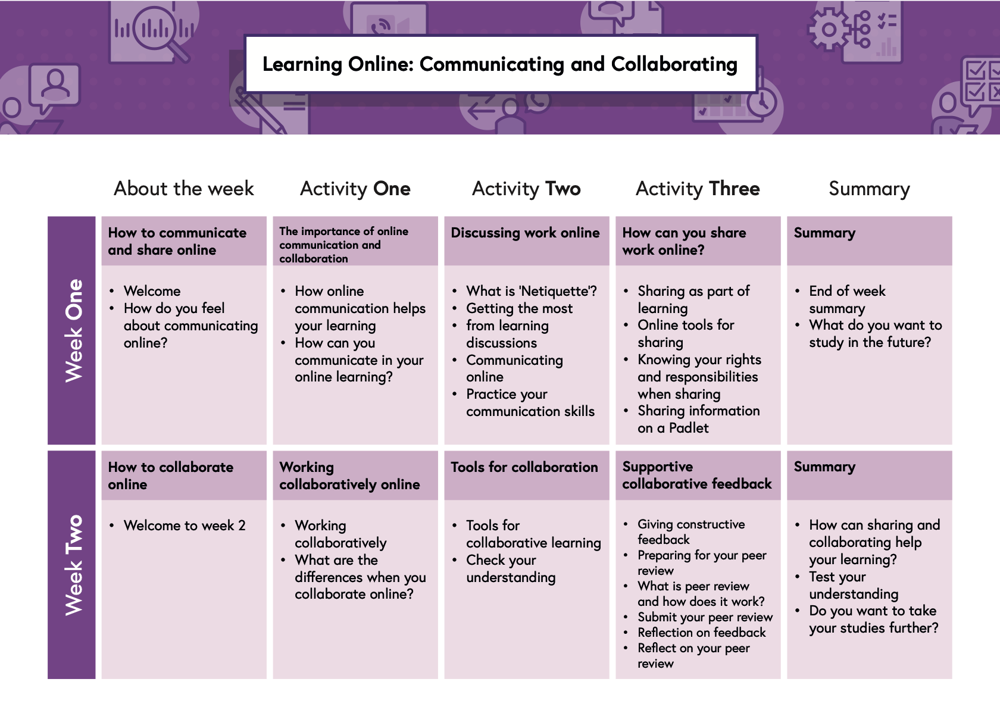

# Week 2

## Warm up activity \(30 minutes\)

A picture tells a story: Let's start our introductions with an image

1. Find an image online of an object that represents you or why are are on the course.  
2. Add the image to our Slack thread and an explanation of why you chose that particular object.  
3. Once you have completed your post, look at what other people have posted.
4. When you find any interesting images and ask that person a follow up question about it.
5. If someone asks a question about your picture. Make sure you reply to their question with an answer

## What's your name? 

Let's make sure we know each other! Make sure your name is visible on Zoom. You can change your name by clicking the three dots on the right hand corner and clicking 'rename' .

If you are a CYF volunteer please add 'Vol or Volunteer' after your name. 

## Shout out your questions \(10 minutes\)

\_\_[_Instructors see here for instructions_](../teacher-resources/instructor-notes-1.md#shout-out-questions)\_\_

Let's make a list of all of the programming questions we'd like to get answered today, and put them on our virtual whiteboard. 

We like to use [Miro](https://miro.com/login/).   

1. Log into Miro \(your instructor will give you the link for your Miro Board\)
2. Find the sticky notes on the board.
3. Find the note you wrote your name on for your coursework assignment. 
4. Write your question on your note \(you must ask a question\)
5. If you have more than 1 question, write each on a separate stiky note. To add a new note, use the toolbar on the left hand side to select a new note.

## Solving problems \(60 minutes\)


Volunteers, please [**read the setup**](../teacher-resources/instructor-notes-1.md#solving-problems-workshop) and resources for this workshop in [Teacher Resource](../teacher-resources/)s so your trainees can get the most out of it. Try playing it beforehand too!


Problem solving is a critical skill for programmers, including for experts. Often programmers spend most of their day solving problems in their code. Learning how to solve problems efficiently is an extremely useful skill.

To help develop your problem solving skills, we'll play a fun game in small groups called...

### **Blockers!** 

[**Online Version of this game**](https://www.dr-mikes-math-games-for-kids.com/online-traffic-jam-game.html) ****

#### **Objectives**

* Share your screen
* Identify the blocker
* Use driver and navigator pattern
* Break down a problem into steps
* Negotiate a strategy with your team
* Follow directions

### **Exercise - 30 minutes**

In groups or breakout rooms of 4 trainees maximum.

One person will share their screen and be the **driver**. The driver can only move the pieces where you are told by the navigators. The driver cannot make any decisions!

The others will be the **navigators**. Together, the navigators must figure out a strategy to unblock the car, and tell the driver how to do it!  
  
**Each person must drive,** so set a timer for ****[**5 minutes per round**](https://www.google.com/search?q=set+a+timer+for+5+minutes) ****and then swap.


TAs can only be passengers. No driving or navigating. TAs may ask questions but not answer them. TAs will make sure the driver and navigators are following their roles correctly. 


### **Back in the main room - 15 minutes**

What did people think about this game? Let’s go around and each group share **one thing** they noticed about it. 

## "Algorithm Recipe" Review \(30 Minutes\)

Last week you should have written a "algorithm recipe". The instructor will pick out a few of the best to read with the rest of the class. We'll see if there are any missing steps!

## Effective Communication \(1 Hour\)

Working remotely \(online\) is different from working together face to face. We will look at how communication works online and get some tips on how to be more effective on this course.  



## Presentations \(30 minutes\)

For last week's coursework, you and a partner will have made a presentation about something you learned in the last week. Now is your chance to present it! We'll break into small groups  take turns to present to the rest of your group for **8 minutes**.

Remember that communicating information to others is a really important skill for programmers. Here are some tips for your presentation:

* Look at your camera. Not the squares of faces on your screen. It will look like you are talking directly to your audience
* Make sure you are not on mute
* Speak clearly - check if everyone can hear you
* Try to make it fun!
* Stick to the time. Make sure each of you speak equally. The volunteer will cut you off at 8 minutes!

## Coursework In Perspective \(20 minutes\)

\_\_[_Instructors see here for instructions_](../teacher-resources/instructor-notes-1.md#coursework-in-perspective)\_\_

Although the block-based coding you practised at home solved only simple problems with a simple language, we'll look briefly at four concepts you used which are also at the heart of professional coding.

## Coursework Time \(120 minutes\)

### Help with Coursework Exercises 

This is your opportunity to ask questions about last week's assignments. If you would like some assistance on any of the exercises, the teaching assistants will be available to help.

### 1-to-1 programming problem with an instructor

Whilst you are getting help with your Coursework exercises, each student will have a work with one of the instructors to solve a programming problem using the Code.org block-programming environment.

## Feedback

To make our course better we love to hear your feedback. Please spend two minutes completing this form.

[Class Feedback Form](https://docs.google.com/forms/d/e/1FAIpQLScq8Zgr0pz7aMDj0D768eCpW798XgtDsKfpA6BquqK5Hdtj4A/viewform?embedded=true&entry.1672476057=Fundamentals&entry.74981796=Week+2)

## Coursework Assignments

### 1. Khan Academy: Intro to JS

We will be studying the [Khan Academy](https://www.khanacademy.org) Intro to JS course. This will give you an introduction to the JavaScript programming language which we will be using for the rest of the syllabus. To get set up follow these instructions:

1. Follow the instructions for registering a Khan Academy account provided by the instructors
2. Click on Courses under `My Stuff`
3. Choose `Adult learner` and go to the next step
4. Choose `Computer Programming` and continue
5. To the right of `Intro to JS: Drawing and Animation`, press Start
6. Click the "Start" button for the "What is Programming?" lesson
7. Read the instructions carefully and try to complete the exercises
8. Complete as many lessons as you can **AT LEAST UP TO** the ["Text and Strings" section](https://www.khanacademy.org/computing/computer-programming/programming#text-basics). You can **SKIP** the "Becoming a community coder" section.
9. As soon as you complete any "project", make sure you submit it for evaluation immediately, to get feedback.

There will be some time in class to start the first exercises. Let the instructors know if you get stuck.

#### No headphones? Read the subtitles or video transcript

If you do not have headphones to watch the videos you can click on "CC" \(subtitles/closed captions\) in the video window, or underneath the video on "Transcript".

### 2. Learning How to Learn course \(3 hours\) 

Continue to **Week 2** of the [Learning How to Learn course](https://www.coursera.org/learn/learning-how-to-learn). What kind of communicator are you?

1. Work through the assignments for **Week 2** of the course. It should take around 3 hours to complete.
2. When you complete the exercises for the week  go to the grades area and post a screenshot in your student area on Google Classroom which shows what you have done.

### OR this if you have already completed the Learning How to Learn course

### 2a. Learning Online: Communicating and Collaborating 

[Learning Online: Communicating and Collaborating](https://www.futurelearn.com/courses/learning-and-collaborating/) is an online course on Future Learn site that teaches you how to become an effective online learner and develop your online communication skills when working with others.

1. Click the "Join course for Free" button and sign up for an account.
2. You can do this with your Google account if you want
3. Work through **Week 1** of the course. It should take around **2 hours** to complete.
4. In each of the Have your say sections, write your comments in a thread on Slack _**not**_ in the comments section on Future Learn. 

> #### Have your say on How can communication help you learn?: 
>
> What’s your experience? Think about the times you’ve worked together with others and communicated with others to help in your learning.
>
> * Do you agree with the points above?
> * Can you think of any other reasons why online conversations help you as a learner?
>
> Share your thoughts in a thread on Slack.
>
>
>
> #### Have your say on What is Netiqette?: 
>
> Think about what you’ve seen in this video. How do your views compare? 
>
> * What is your understanding of netiquette?
> * Do you have an example to share?
>
> Share your thoughts in a thread on Slack.
>
> #### Have your say on Communicating online: 
>
> Have you experienced anything like these situations in your own online interactions?
>
> What kind of situations will come up during this Fundamentals course?  
>
> Share your thoughts in a thread on Slack.  
>
>
> #### Apply your learning
>
> The topic of the discussion is:
>
> > **Do you think it is right that people can post anonymously online?**
>
> Think carefully about your views on this topic. You may want to share the question with people in your social networks, to get their views. You can use the course tag to see what other people are saying.
>
> If you are posting on Twitter, tag your posts with [\#FLCommunicatingOnline](https://twitter.com/search?q=%23FLcommunicatingOnline) and [@uoldigital](https://twitter.com/uoldigital?lang=en).
>
> Remember to apply your learning from this course when talking to others on your social networks.
>
> When contributing to the conversation, you might want to consider points such as:
>
> * Should people be held accountable for comments left online?
> * When \(if ever\) might it be important to be able to post anonymously?
> * Is it appropriate that many posts remain online forever?
> * Should an online post be treated the same as a face-to-face comment?
>
> > **Taking part in the discussion**
> >
> > Once you have thought about your answer, and potentially heard from others, summarise your views on a thread in Slack.
> >
> > Remember that this is a discussion, so as well as making your own comment, read and respond to other people’s views:
> >
> > * You can use reactions on posts you find interesting or useful.
> > * Try to reply meaningfully to at least two other comments.

### 3. How to improve your workplace communication 

As we work together online it can be even more tricky to communicate effectively. Learn three ways you can improve how you send and receive messages here at CodeYourFuture and in your other workplaces. 

1. Read this [article on communication](https://www.loom.com/blog/improve-your-workplace-communication)
2. Watch the embedded video Karina's Communication and Work Style
3. After reading and watching the video, go back to **Step two: Determine how you communicate.** 
4. Think about the scenarios they present in this section
5. Write down how you would approach each scenario
6. Think about your preferred ways of communicating, the communication tools you rely on, and the things that annoy you about other's communication.
7. Using your answers for the above, try to write your own guide to your Communication style \(just this section, not your whole user manual! \).  Post your guide in your studetn area on Google Classroom You can also have a go at recording a Loom video if you choose. 

### 4. Organise a study session 

Working together is the best way for you to learn. Teaching someone else helps to strengthen your knowledge. And getting help from your fellow students saves you time and keeps you from becoming a passive learner.  

You will be randomly assigned a group using [random list team generator](https://www.randomlists.com/team-generator) 

In small groups of 3, organise a study session to work on one piece of coursework. 

As a group you must decide on: 

1. The topic of the call 
2. The time of call \(give people a few hours to get ready. Remember Slack is asynchronous communication!\)
3. Who will create the link to Google Meet where you will have the call. 
4. Who will open \(start\) the call in Google Meet. 

Once you have decided the above: 

1. Make an announcement in Slack with your topic, time and link to call \(anyone in can join even if they are not in your group. Just keep to just one topic and max 5 -6 people in a call\)
2. Ask people to react if they want to attend
3. If there are too many people - what should you do? Decide on a plan of action 

