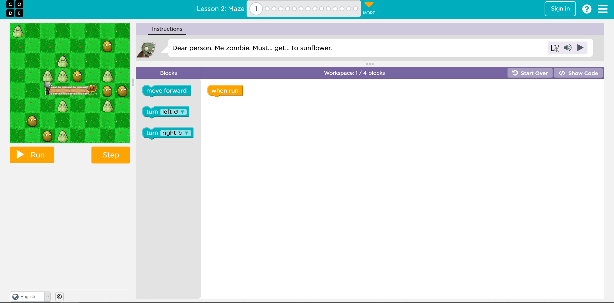

# Overview

General notes for the instructors of this course.

There are instructor notes for each lesson:

* [Lesson 1](instructor-notes.md)
* [Lesson 2](instructor-notes-1.md)
* [Lesson 3](instructor-notes-2.md)
* [Lesson 4](instructor-notes-3.md)

## Goals

There 2 main goals of this course:

> 1. **Help** students with little or **no prior programming experience** to learn some fundamental concepts of programming
> 2. **Assess** the students to help work out if they would **struggle** on the web development course

## Course Overview

### 1\) Code.org

At the start of the course we use Code.org and Block Based coding to start the process of learning about algorithmic thinking. It might seem easy but it helps to lay the foundation that build the rest of the course off!

### 2\) Khan Academy

Next, we use KhanAcademy to guide the students along a visual course using JavaScript. This is the  majority of the course.

### 3\) Games & Energisers

In the morning and afternoon we play games an energisers to get to know each other.

You can find a resources for these [here](engergisers.md).

### 4\) Assessments

A really important part of this course is the assessment section which happens either during classes or in the time in between. The question we are trying to answer during Fundamentals is 

> Does this student have the commitment and show the qualities we need for them to complete the Full Stack Course?

The assessments take place in weeks 2, 3 and 4. See the [Assessments ](assessments.md)page for more details. 

